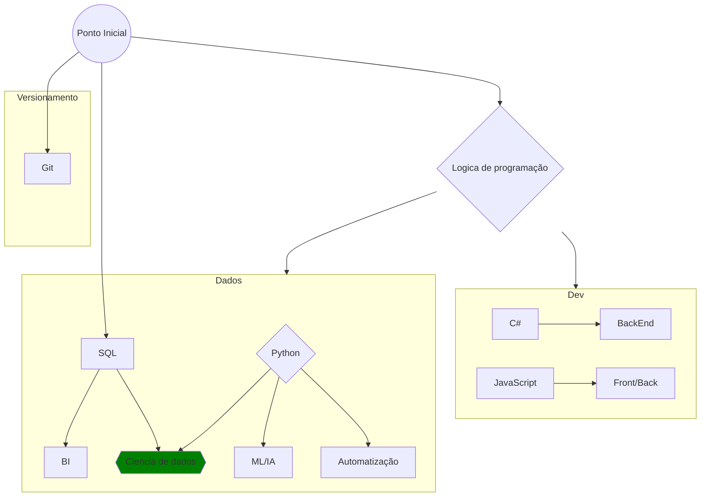

# Vida de estagiário
Abaixo será apresentado os principais pontos que vamos abordar nessa jornada conjunta. *lembrando que esse grafico será modificado de acordo com o aprendizado fornecido no nosso canal.*

----
**Gráfico de aprendizado**

----
**Fontes:**

<a target="_blank" href="https://www.youtube.com/watch?v=R61YRqiYDnA&list=PLpdAy0tYrnKxirQ0CqoGGSBFUI9MC8kAW"  >Função de Janela</a>  
<a target="_blank" href="https://www.w3schools.com/SQL/sql_ref_alter_column.asp"  >SQL - W3C School</a>  
<a target="_blank" href="https://www.coginiti.co/tutorials/beginner/rename-column/"  >Coginiti</a>  
<a target="_blank" href="https://learnsql.com.br/blog/qual-e-a-diferenca-entre-count-count1-countnome-da-coluna-e-countdistinct-nome-da-coluna/"  >Learn SQL</a>  

