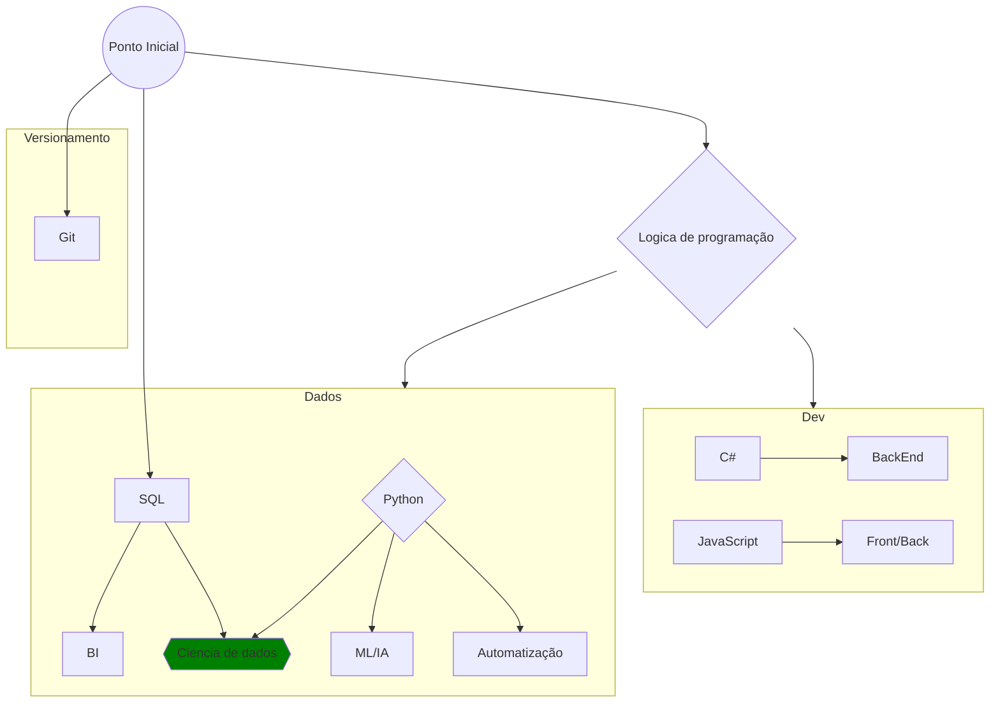

# Vida de estagiário
Abaixo será apresentado os principais pontos que vamos abordar nessa jornada conjunta. *lembrando que esse grafico será modificado de acordo com o aprendizado fornecido no nosso canal.*

----
**Gráfico de aprendizado**

----
**Fontes:**

<a href="https://mermaid.js.org/syntax/flowchart.html" target="_blank">Mermaid - MD</a>  
<a href="https://www.youtube.com/watch?v=_yBXhKfqDRI" target="_blank">Mermaid Embedd in GitHub</a>  
<a href="https://www.w3schools.com/git/default.asp?remote=github" target="_blank">W3C - Git</a>  
<a href="https://www.w3schools.com/js/default.asp" target="_blank">W3C - JavaScript</a>  
<a href="https://www.w3schools.com/python/default.asp" target="_blank">W3c - Python</a>  
